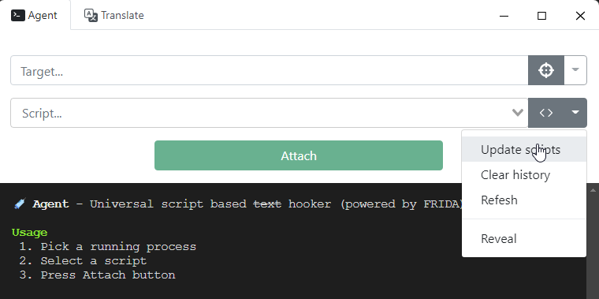

# Введение

Тут будет показано какой софт нужно использовать чтобы играть и майнить видеоигры, преимущественно визуальные новеллы, с комфортом и удовольствием.

-----

# Содержание 

[[toc]]

## Locale Emulator (Windows)

Многие японские игры некорректно работают без японской локали. Её либо можно поменять у себя на компьютере на такую, либо можно скачать эмулятор локали и запускать с ним японские игры. Тут будет показан второй вариант.

Скачайте на [GitHub](https://github.com/xupefei/Locale-Emulator/releases) последний релиз, выгрузите его в папочку со всеми другими программами. Запустите LEInstaller.exe и нажмите `Install for current user` или `Install for all Users` по желанию. После перезагрузки компьютера, при запуске программ, которые этого требуют, будет вариант `Run In Japanese`. Если вы устанавливаете японские программы, лучше запускать от имени администратора.

## Textractor

Эта программа предназначена для того, чтобы вытаскивать текст из ВН и использовать его с Yomitan/JL. Работает с большинством ВН.

### Установка

Скачайте на [GitHub](https://github.com/shiiion/steinsgate_textractor) последнюю версию программы. После обычной установки должно быть 2 версии программы: `x86` и `x64`, они настраиваются отдельно (но все одинаково). Нужно использовать ту версию, которая совпадает с игрой, т.е если игра 64-битная, то и `Textractor` нужно запускать `х64`.

При запуске у вас будут различные всплывшие окна, их можно закрыть нажатием `Esc`. Нажмите на **Extentions**, там нужно удалить нажатием `Delete` все лишнее, чтобы остались `Copy to Clipboard` и `Remove Repeated Characters`

### Использование

Теперь можно попробовать вытащить текст из игры. Нажмите Attach to game и выбирете процесс игры. Он может называться не так, как окно, если что в диспетчере задач можно найти название или по иконке. Нажимаете **ОК**, и тыкните один раз в игру, чтобы процессы пошли. После завершения инжекта, еще раз нажмите на диалог, чтобы пошла следующая строка, и в экстракторе тыкните на 0:0:FFFFFFFFF:FFFFFFF:FFFFFFFFFF: Console и выбирете любой процесс (желательно самый верхний), и теперь жмите стрелочку вниз пока не найдете строчки текста из игры. Пример данного действия ниже:

<video controls>
  <source src="/public/textractor.mp4" type="video/mp4">
  Your browser does not support the video tag.
</video>

Если не получилось, попробуйте нажать на **"Search for hooks"**, поставьте галочку и сначала просто **Start hook search**. Если не находит, снова **"Search for hooks"** > **Search for specific text** и постарайтесь ввести то, что вы видите на экране, но максимально точно. Если даже так он не найдет нужные хуки - идите в интернет с поиском конкретной игры, например вот текстрактор для [Stein's Gate](https://github.com/shiiion/steinsgate_textractor). Если старых постов нет - просите помощи или пользуйтесь другими программами, о которых написано далее.

## Agent

**Agent** это программа которая делает то же самое, что и **Textractor**, но с другими программами. Например, она работает с играми через эмуляторы **yuzu, vita3k, ppsspp, rpcs3** или серией игр **Persona** и даже работает на **Android**! Полный список игр можно посмотреть [тут](https://github.com/0xDC00/scripts). Некоторые игры без эмуляторов можно хукать без скрипта, но как повезет.

### Установка и настройка

Скачиваете архив с [GitHub](https://github.com/0xDC00/agent/releases) для вашего устройства, в случае Windows перебрасываете содержимое архива в новую папочку Agent в своей папочке с программами, запускаете `agent.exe`. При первом запуске нужно скачать все скрипты, нажимаете как на скриншоте.

теперь зайдите во вкладку Translate, выключите `Machine Translate`, Update Scripts поставьте на 24 или 48ч.

### Применение

Когда у вас будет запущена игра, вы можете либо выбрать процесс, либо перетащить "прицел" на окно программы, потом нужно выбрать подходящий скрипт и нажать Attach. Если скрипт подходящий и все правильно - будет сообщение о том что все хорошо и текст будет копироваться в буфер. Вот [видео пример](https://www.youtube.com/watch?v=dFfuq2UnKjU&list=PLTZXVVG9AT6Sbl1Yg42sxzVAS6IMfnaNH&index=2)

## Game2Text

Если хукеры не работают, то можно попробовать OCR. Оно сканирует экран и пытается понять что написано. Это неточно и медленно, но возможно лучше, чем ничего.

Скачать можно [тут](https://game2text.com/download/).

Программа работает через веб, вам нужно разрешить браузеру транслировать экран и выбрать игру. Когда откроется "трансляция", выделите часть экрана, где появляется текст и надейстесь на нормальные результаты. В нем же можно использовать **Yomitan**.

В настройках можете попробовать разные виды OCR движков. OCR локальный, если норм комп, то быстрее, но хуже.